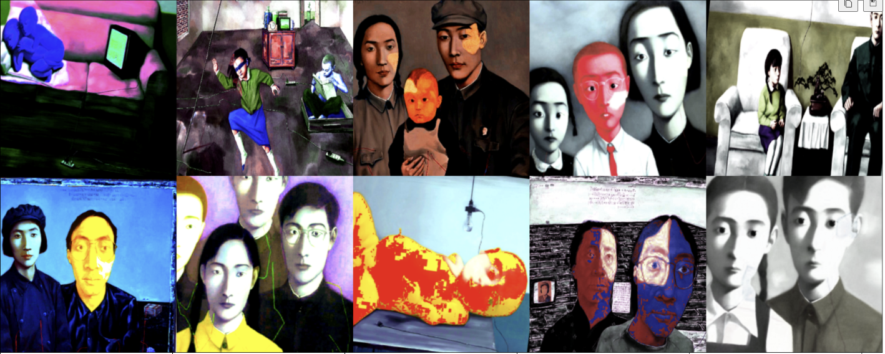
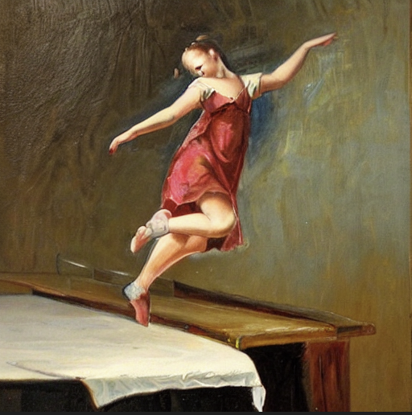
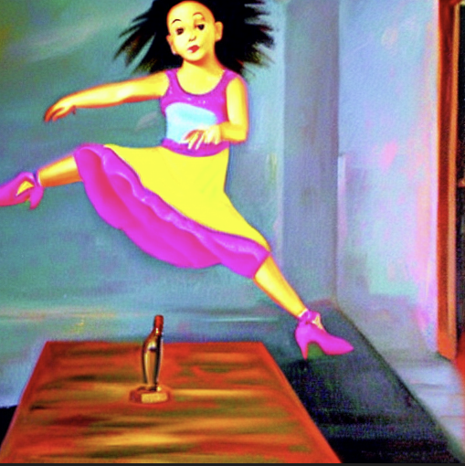
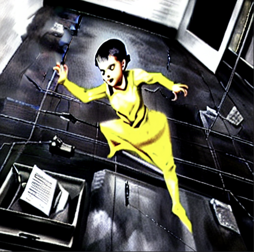
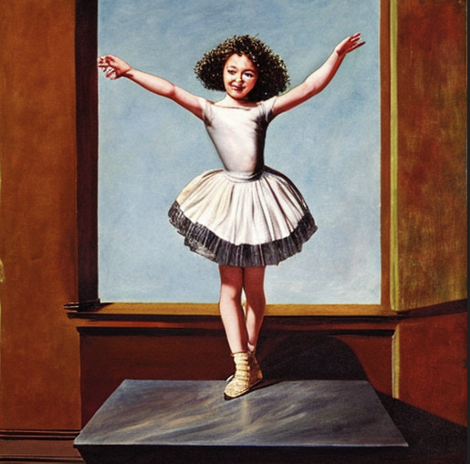

# Stable Diffusion Exploration:

In this project I did the following three things:

1. Collect a custom dataset
2. Finetune a stable diffusion model based on the dataset
3. Auto prompt engineer to get good results

## Step One:
I built my dataset based on [this](https://www.pacegallery.com/artists/zhang-xiaogang/) artist's, Xiaogang Zhang's, works. I used the [BLIP](https://github.com/salesforce/LAVIS) model to generate captions for each image. I also used [imgaug](https://github.com/aleju/imgaug) for image augmentation. The full steps are in `clean_data.ipynb`. Below are some sample data images.

## Step Two:
Fine-tune the Stable Diffusion model on my style. I used the LORA style of fine-tuning. The full steps are in `finetune.ipynb`. 
The used prompt is "a painting of a girl dancing on top of a table". 
The result image before finetuning: 

The result image after finetuning, with `num_inference_steps=25, guidance_scale=7.5, cross_attention_kwargs={"scale": 0.5}`: 

The result image after finetuning, with `num_inference_steps=25, guidance_scale=7.5`: 

## Step Three:
In this step,I tried to force the model into a good aesthetic: https://wandb.ai/johnowhitaker/midu-guidance/reports/Mid-U-Guidance-Fast-Classifier-Guidance-for-Latent-Diffusion-Models--VmlldzozMjg0NzA1. It basically uses the U-net to extract some middle features and train an aesthetic classifier based on that. Then it uses the aesthetic classifier to guide the diffusion process. 
There're three notebooks. `preprocess_laion.ipynb` is for preprocessing the training data. I used the [laison-art](https://huggingface.co/datasets/laion/laion-art) dataset to get the aesthetic value of each painting. `prompt_engineer_exploration.ipynb` is for exploring the aesthetic guidance idea. And `prompt_engineer.ipynb` is the actual inference script. 
I used the same prompt as in the previous step, "a painting of a girl dancing on top of a table". 
The result image before aesthetic guidance: 

The result image after aesthetic guidance, with `guidance_loss_scale=30`: 
